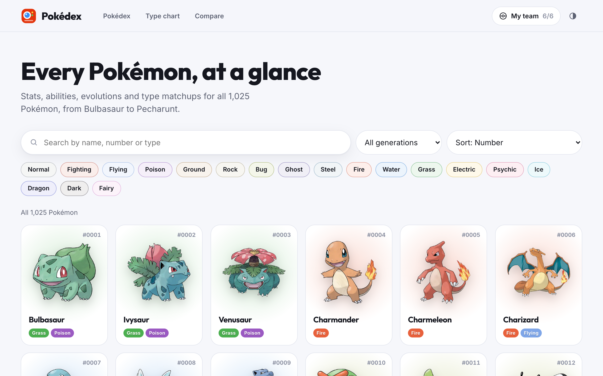
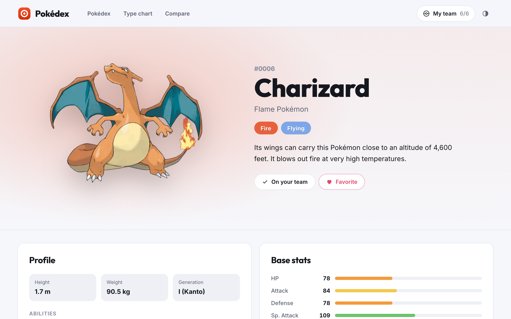
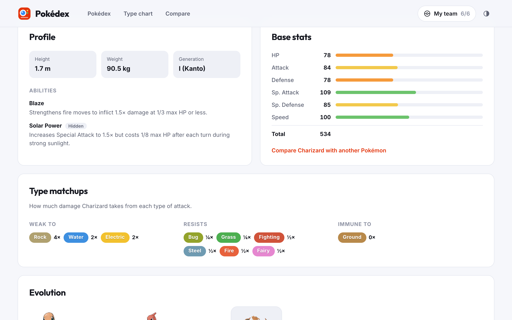
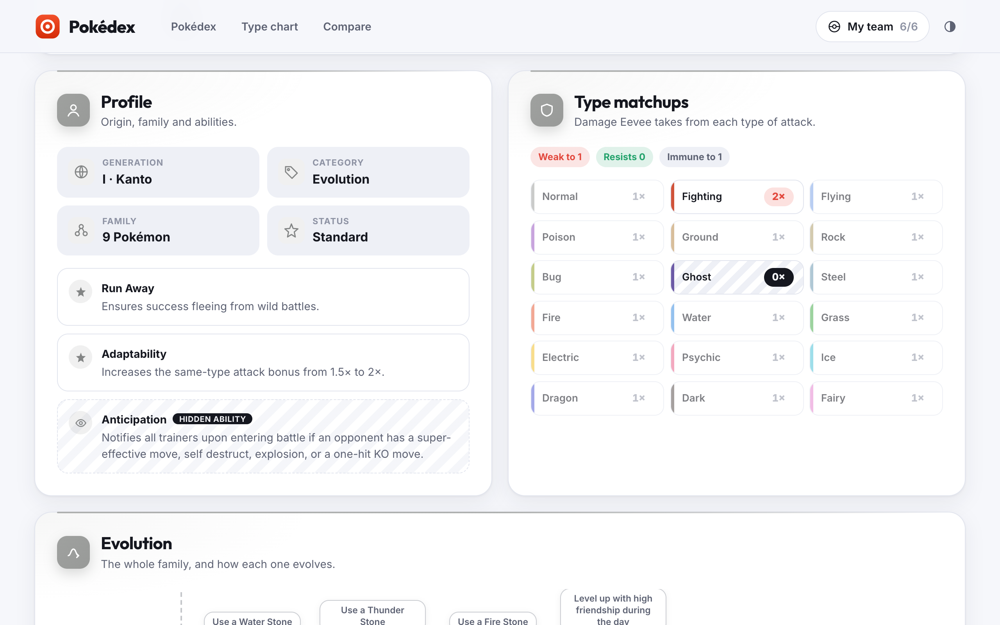
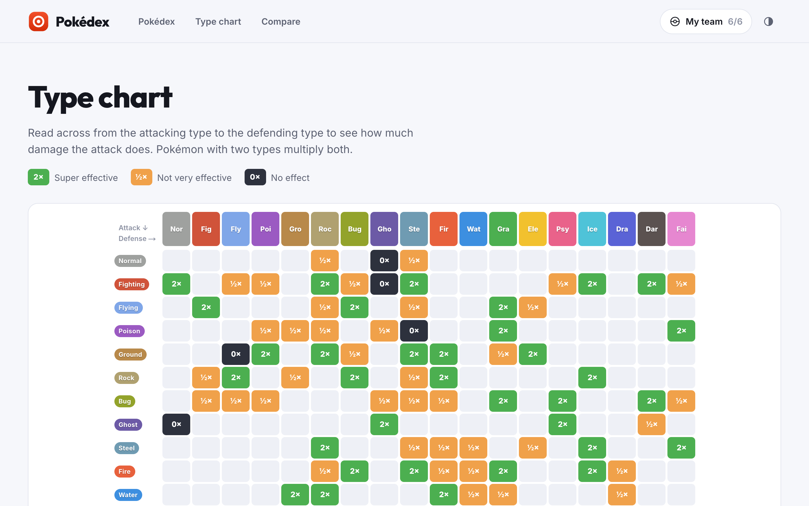
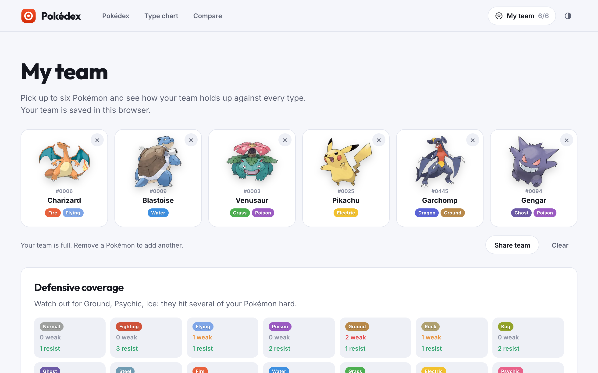
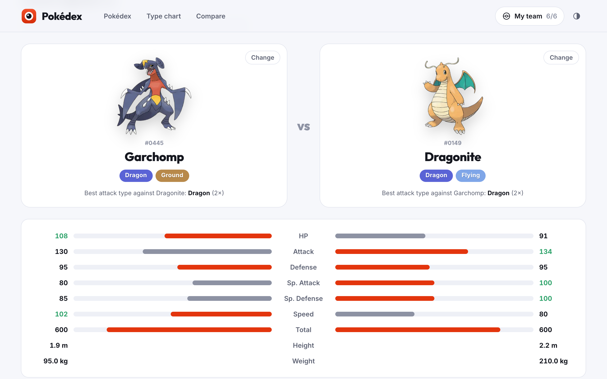
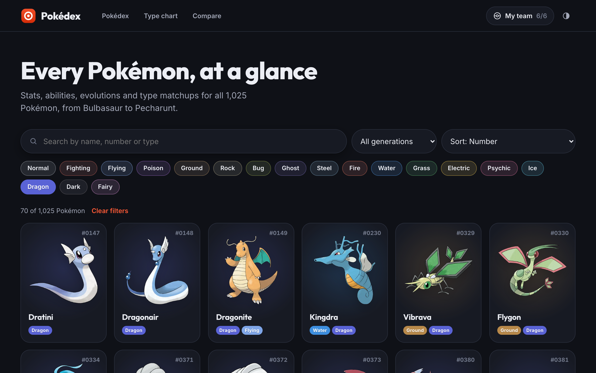
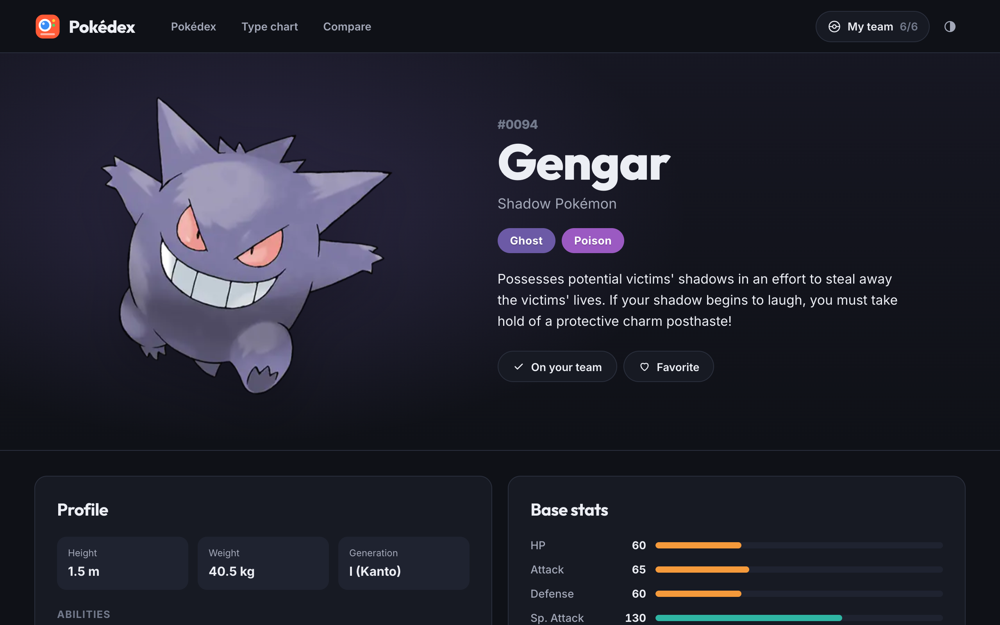

<div align="center">

# Pokédex

**Every Pokémon, at a glance: stats, abilities, evolutions and type matchups for all 1,025 Pokémon, plus a type chart, a team builder and side-by-side comparisons.**

[](https://nextjs.org)
[](https://react.dev)
[](https://www.typescriptlang.org)
[](https://sass-lang.com)
[](https://vitest.dev)
[](https://pnpm.io)
[](LICENSE)
<br />
[](https://github.com/boushib/pokedex/commits/main)
[](https://github.com/boushib/pokedex)



</div>

## Screenshots

| | |
| --- | --- |
| <br />**Pokémon page**: artwork, types, Pokédex entry, size and abilities | <br />**Base stats and matchups**: what it's weak to, resists and ignores |
| <br />**Evolutions**: every branch, with how each one happens | <br />**Type chart**: all 18 types, attacking and defending |
| <br />**Team builder**: up to six Pokémon, with weak spots across the team | <br />**Compare**: two Pokémon side by side |
| <br />**Dark mode**, following the system or your choice | <br />**Pokémon page** in dark mode |

## About

I first built this in April 2022 with Create React App, fetching PokéAPI from the browser on every visit. In 2026 I rebuilt it on **Next.js 16** and **React 19**: the data now comes from a snapshot of PokéAPI, so every page is pre-rendered, loads instantly and never calls the API at runtime.

## Features

- **Browse** all 1,025 Pokémon: search by name, number or type, filter by type and generation, sort by number, name or base stat total. Filters live in the URL, so any view can be shared
- **Pokémon pages** with official artwork, Pokédex entry, height, weight, abilities (hidden ones marked), base stats, type matchups, the full evolution family and links to the previous and next Pokémon
- **Type chart** of every attacking and defending combination
- **Team builder**: pick up to six, see which types hit several of them hard and which they cover, and share the team as a link
- **Compare** two Pokémon stat by stat, with size and the best type matchup each has against the other
- **Favorites**, saved in the browser along with your team
- Light and dark themes with no flash on load, keyboard-friendly pickers, and reduced motion respected

## SEO

- All 1,036 pages are static: 1,025 Pokémon, the home page, the type chart and the tools
- A title, description and canonical link on every page, and a **share image** for each Pokémon with its artwork, types and stats
- Structured data (WebPage and BreadcrumbList) on Pokémon pages
- A sitemap of every public page and a `robots.txt` that keeps personal pages (favorites) out of search
- Unknown Pokémon get a proper 404

## How the data works

`pnpm data` takes a snapshot of [PokéAPI](https://pokeapi.co) through its GraphQL endpoint, in a handful of large queries rather than thousands of REST calls, and writes it to `data/`:

| File | What's in it |
| --- | --- |
| `pokemon.json` | Every species: name, category, generation, types, stats, abilities, size, evolution details and Pokédex entry |
| `abilities.json` | Name and effect of every ability those Pokémon have |
| `types.json` | The 18 types and the damage multiplier for each pairing |
| `meta.json` | Where and when the snapshot was taken |

The snapshot is committed, so the site builds without any network access. Run `pnpm data` again when new Pokémon come out. The official artwork comes in high resolution (mostly 1,200px and up) from [HybridShivam/Pokemon](https://github.com/HybridShivam/Pokemon), named by Pokédex number, and the image optimizer resizes it for each spot. Share images and structured data use the lighter 475px copy from [PokeAPI/sprites](https://github.com/PokeAPI/sprites).

## Getting started

Requires Node.js 22+ and pnpm. No environment variables are needed.

```bash
pnpm install
pnpm dev
```

Then open [http://localhost:3000](http://localhost:3000).

When deploying, set `SITE_URL` (e.g. `https://pokedex.example.com`) so canonical links, the sitemap and share images use your domain.

## Scripts

| Script | What it does |
| --- | --- |
| `pnpm dev` | Dev server |
| `pnpm build` / `pnpm start` | Pre-render every page and serve them |
| `pnpm data` | Refresh the PokéAPI snapshot in `data/` |
| `pnpm test` | Vitest: the snapshot, type matchups and evolution descriptions |
| `pnpm typecheck` | TypeScript, no emit |
| `pnpm lint` | ESLint |

## Project structure

```
app/                  Pages: browse, Pokémon, type chart, team, compare, favorites, plus sitemap, robots and share images
components/           Cards, filters, stat bars, evolution chain, team builder, compare and the site shell
lib/pokemon.ts        Reading the snapshot: lookups and neighbours
lib/format.ts         Numbers, names, stats, generations and artwork links, safe to use in the browser
lib/types.ts          Type colors, the damage chart and matchups
lib/evolution.ts      Evolution families and how each step happens
lib/collection.ts     Favorites and team, saved in the browser
data/                 The PokéAPI snapshot
scripts/fetch-data.ts Takes the snapshot
tests/                Vitest tests
```

## Disclaimer

This is an unofficial fan project, not affiliated with or endorsed by Nintendo, Game Freak, Creatures or The Pokémon Company. Pokémon and Pokémon character names are trademarks of Nintendo. Data comes from [PokéAPI](https://pokeapi.co).

## License

The code is [MIT](LICENSE) © El Hassane Boushib. Pokémon names, artwork and data belong to their owners.
